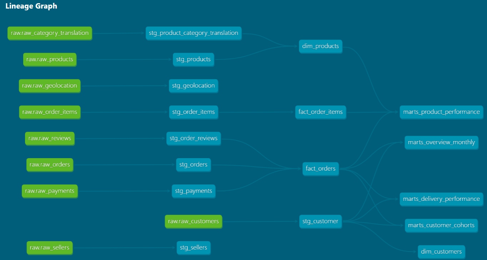
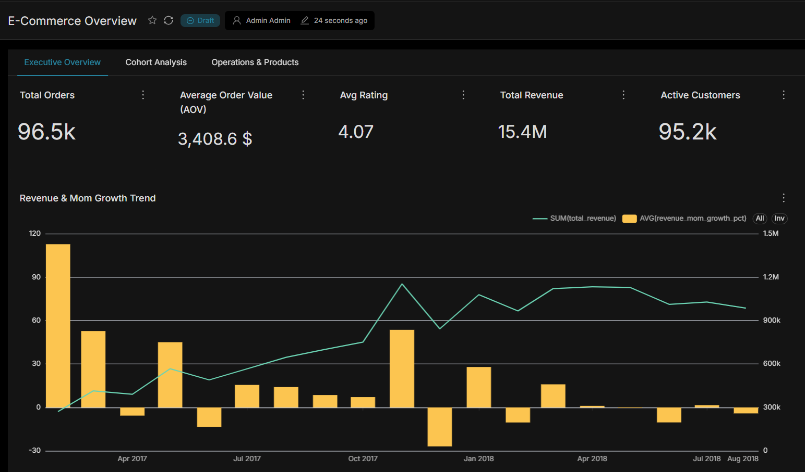
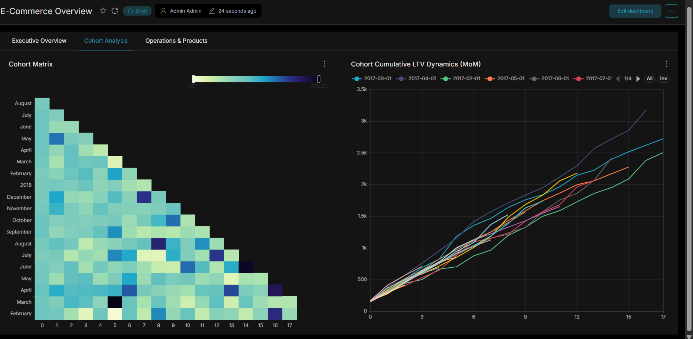
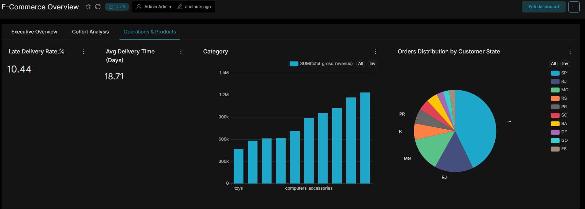

# Data Platform Lab - e-commerce DWH (Postgres → ClickHouse → dbt → Superset)

Учебно-практический проект аналитического хранилища данных (DWH), построенного на реальном e-commerce датасете. Полный цикл: от сырых CSV-файлов до готовых BI-дашбордов.

Цель проекта — воспроизвести типичный стек команды аналитики/DWH в российских финтех- и e-commerce компаниях (Postgres/ClickHouse + dbt + Airflow + Superset).

---

## 🗂 Источник данных

Использован открытый датасет **Olist** (бразильская e-commerce площадка, ~99 тыс. заказов, 2016–2018 гг.), включающий заказы, позиции заказов, клиентов, товары, продавцов, платежи и отзывы.

Датасет скачан в виде набора CSV-файлов и служит имитацией выгрузки из боевой (OLTP) системы интернет-магазина.

---

## 🏗 Архитектура

```
CSV-файлы (источник)
        │
        ▼
   PostgreSQL  ──────────────►  начальная загрузка (landing/raw)
        │
        │  репликация сырых таблиц
        ▼
   ClickHouse  (raw)
        │
        ▼
 ┌──────────────────┐
 │   dbt-clickhouse  │   ── SQL-модели, тесты, документация
 └──────────────────┘
        │
   ┌────┴─────┬──────────────┐
   ▼          ▼              ▼
staging      core           marts
(views)   (dim_*, fact_*) (агрегаты для BI)
        │
        ▼
    Superset  ──►  дашборды
```

**Почему два движка (Postgres + ClickHouse), а не один?**
Postgres выступает в роли первичной точки посадки данных (аналог того, как выгрузка из боевой OLTP-системы сначала попадает в промежуточное хранилище). ClickHouse — колоночная аналитическая СУБД, оптимизированная под тяжёлые агрегации по большим объёмам, поэтому вся дальнейшая трансформация (staging → core → marts) выполняется уже в нём.

---

## 🛠 Технологический стек

| Компонент | Роль |
|---|---|
| **Docker / Docker Compose** | Поднимает и связывает все сервисы в единой сети |
| **PostgreSQL** | Первичная посадочная зона данных (landing) |
| **ClickHouse** | Аналитическая СУБД (OLAP), хранит staging/core/marts |
| **dbt Core + dbt-clickhouse** | Трансформация, тестирование и документирование моделей |
| **Apache Superset** | BI-слой, дашборды поверх витрин |

---

## 🐳 Docker

Все сервисы описаны в едином `docker-compose.yml` и поднимаются одной командой:

```bash
docker compose up -d
```

Полная конфигурация — в `docker-compose.yml` в корне репозитория. Кратко:

| Сервис | Образ | Порты (host:container) | Назначение |
|---|---|---|---|
| `postgres` | `postgres:15` | `5433:5432` | Посадочная зона (landing) |
| `clickhouse` | `clickhouse/clickhouse-server:latest` | `8123:8123` (HTTP), `9000:9000` (native) | Аналитическое хранилище |
| `superset` | сборка из `./superset/Dockerfile` | `8088:8088` | BI-слой |

Порт Postgres проброшен на нестандартный `5433` (не `5432`), чтобы не конфликтовать с локально установленным Postgres на машине — учитывай это при подключении.

Данные каждого сервиса сохраняются в именованных volumes (`postgres_data`, `clickhouse_data`, `superset_data`), чтобы не терять таблицы при `docker compose down`.

**Superset собирается из собственного Dockerfile**, а не берётся готовым образом `apache/superset` — потому что базовый образ не умеет подключаться к ClickHouse. Dockerfile (`superset/Dockerfile`) доустанавливает драйвер `clickhouse-connect` поверх `apache/superset:latest`:

```dockerfile
FROM apache/superset:latest
USER root
RUN uv pip install --python /app/.venv/bin/python clickhouse-connect
USER superset
```

Без этого шага Superset не сможет добавить ClickHouse как источник данных.

> ⚠️ Пароли и `SUPERSET_SECRET_KEY` в `docker-compose.yml` — заглушки для локальной разработки. Если репозиторий публичный, замени `SUPERSET_SECRET_KEY` на сгенерированный (`openssl rand -base64 42`) и не используй эти же пароли где-либо ещё.

---

## 📊 Слои данных

1. **RAW** — сырые таблицы, скопированные из Postgres в ClickHouse без изменений.
2. **STAGING** (`analytics_staging`) — приведение типов, очистка NULL/дублей, стандартизация форматов (views).
3. **CORE** (`analytics_core`) — модель по методологии Кимбалла (Star Schema):
   - Измерения: `dim_customers`, `dim_products`
   - Факты: `fact_orders`, `fact_order_items`
4. **MARTS** (`analytics_marts`) — готовые витрины под конкретные бизнес-вопросы:
   - `marts_overview_monthly` — динамика выручки, AOV, MoM-рост, средние оценки покупателей
   - `marts_customer_cohorts` — когортный анализ retention и LTV
   - `marts_delivery_performance` — сроки доставки и % задержек по штатам
   - `marts_product_performance` — выручка и продажи по категориям товаров

---

## 🧪 Контроль качества данных

В проекте настроены dbt-тесты:

- `unique` / `not_null` — на первичных ключах (заказы, клиенты, товары);
- `relationships` — целостность связей между фактами и измерениями;
- `accepted_values` — валидность статусов заказов (`delivered`, `shipped`, `canceled` и т.д.).

Запуск:

```bash
dbt build      # сборка всех моделей + прогон тестов
dbt test       # только тесты, без пересборки таблиц
```

---

## 📖 Документация и Lineage

```bash
dbt docs generate
dbt docs serve
```

Открывает интерактивный граф зависимостей моделей и описания полей на `http://localhost:8080`.

---




## 📈 BI-дашборды (Superset)

Дашборд **«E-Commerce Overview»** включает:

- Total Revenue / Total Orders — ключевые показатели;
- Динамику выручки по месяцам;
- Топ-10 категорий товаров по выручке.




---

## 📁 Структура проекта

```
data_lab/
├── models/
│   ├── staging/          # Staging-модели (views)
│   ├── core/              # Измерения и факты (tables)
│   └── marts/              # Аналитические витрины (tables)
│       └── _marts_models.yml
├── dbt_project.yml
├── profiles.yml
└── docker-compose.yml
```

---

## 🚀 Быстрый старт

```bash
# 1. Поднять инфраструктуру
docker compose up -d

# 2. Установить адаптер dbt
pip install dbt-clickhouse

# 3. Проверить соединение
cd data_lab
dbt debug

# 4. Собрать весь проект
dbt build

# 5. Открыть Superset
# http://localhost:8088

# Postgres доступен на localhost:5433 (не 5432)
# ClickHouse — localhost:8123 (HTTP) / localhost:9000 (native)
```

---
